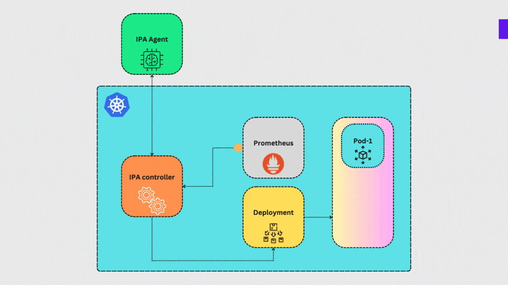
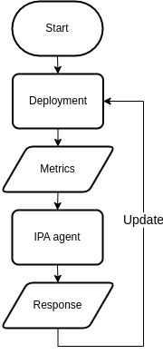

# Intelligent Pod Autoscaler
<!-- ### TL;DR:
Intelligent Pod Autoscaler is a kubernetes native autoscaler that uses LLM to analyze metrics and make scaling decisions. -->

### Introduction
The Intelligent Pod Autoscaler (IPA) is a Kubernetes operator designed to revolutionize how applications scale in containerized environments. By combining metrics collection from Prometheus with the analytical capabilities of a Large Language Model (LLM), IPA provides a smarter, data-driven approach to scaling decisions. Traditional autoscalers often rely on simple threshold-based rules, which can result in suboptimal performance or resource wastage. IPA overcomes these limitations by leveraging artificial intelligence to analyze complex metrics patterns, predict workload trends, and scales the application horizontally and vertically.

IPA integrates seamlessly into Kubernetes clusters, collecting cluster and application specific metrics. This data is processed using the power of LLMs, which can identify nuanced correlations and provide recommendations that adapt to dynamic workloads. Whether it's preventing resource bottlenecks during traffic surges or optimizing costs during low-demand periods, IPA ensures your applications always have the right number of pods and right amount of resources at the right time.

Intelligent Pod Autoscaler is a game-changer for DevOps teams, enabling them to achieve greater operational efficiency, improved application performance, and reduced cloud costs.


### Architecture and workflow
IPA architecture -



The Intelligent Pod Autoscaler (IPA) is deployed as a Custom Resource Definition (CRD) in Kubernetes, allowing users to create IPA custom resources. These resources take deployment information for applications running in the cluster as input. The IPA architecture consists of the following key components:

- **IPA Controller**: The controller continuously collects application-specific and other relevant metrics from Prometheus. These metrics contains CPU and memory utilization, network request rate, cluster resource utilization, etc. It then creates a `POST` request containing this data and sends it to the IPA Agent. The reconcilliation process heppens every minute.

- **IPA Agent**: Users can either use a shared IPA Agent or host their own instance. The IPA Agent leverages the state-of-the-art Gemini LLM model to analyze the collected metrics. Based on this analysis, it generates precise scaling recommendations, including the optimal number of pods and updated resource requests and limits. IPA controller internally sends `/llmagent` endpoint of the IPA agent.

- **Feedback Loop**: The scaling recommendation generated by the IPA Agent is sent back to the IPA Controller. The controller then updates the Kubernetes deployment with the recommended number of pods and adjusted resource configurations, ensuring the application is always appropriately scaled.

Here is the flow chart for the reconciliation process -



### Usage
The Intelligent Pod Autoscaler (IPA) is designed to autoscale deployments within a Kubernetes cluster. To ensure proper functionality, the following prerequisites and recommendations must be met:

- **Prometheus Setup**: Ensure that Prometheus is deployed and running in your Kubernetes cluster. IPA relies on Prometheus to collect metrics required for scaling decisions.

- **Nginx Ingress Controller**: IPA collects HTTP traffic metrics from the Nginx Ingress Controller. Therefore, it is recommended to use the Nginx Ingress Controller to expose your application. This setup allows IPA to monitor and respond to traffic fluctuations effectively.

Once these components are in place, IPA can be deployed and configured to manage the scaling of your applications dynamically, ensuring optimal performance and resource utilization.


To deploy IPA Custom Resource Definition (CRD), use the following command -
```bash
kubectl apply -f https://raw.githubusercontent.com/shafinhasnat/ipa/refs/heads/main/dist/install.yaml?token=GHSAT0AAAAAAC5ELJ5KMUCZDFQPWZELOFW2Z4HUJLA
```
*Note: The repo is currently private and will be made public soon.*

Then create IPA custom resource with `kubectl apply -f`. 
```yaml
apiVersion: ipa.shafinhasnat.me/v1alpha1
kind: IPA
metadata:
  name: <IPA name>
spec:
  metadata:
    prometheusUri: <Prometheus service FQDN>
    llmAgent: https://ipaagent.shafinhasnat.me
    ipaGroup:
    - deployment: <Deployment name>
      namespace: <Deployment namespace>
      ingress: <Ingress name>
```
Thats it! IPA will take care of scaling your application. To see IPA agent in action, check out IPA agent logs in `https://ipaagent.shafinhasnat.me` path of IPA agent.

#### Dev environment
In IPA operator dev environment, use following command to install and run the CRD and controller-
```bash
make install run
```
Use following command to build new version of controller image-
```bash
make docker-build docker-push IMG=shafinhasnat/ipa:<version>
```
To deploy and undeploy-
```bash
make deploy IMG=shafinhasnat/ipa:<version>
make undeploy
```
To build CRD installer-
```bash
make build-installer IMG=shafinhasnat/ipa:<version>
```

### Conclusion
The Intelligent Pod Autoscaler (IPA) ensures the perfect assignment of resources and replicas by leveraging the power of AI. By analyzing real-time metrics and predicting workload patterns, IPA simplifies the complexities of autoscaling applications in Kubernetes clusters. It empowers teams to optimize performance, reduce costs, and achieve greater operational efficiency. Whether handling sudden traffic spikes or maintaining resource efficiency during low demand, IPA is the intelligent choice for modern application scaling.
